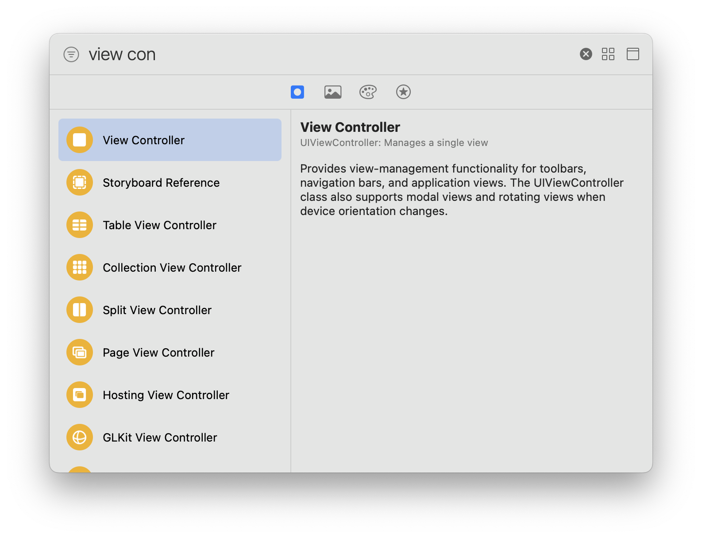
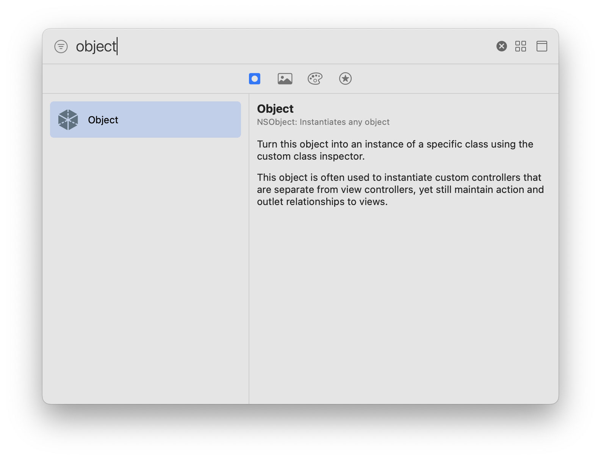
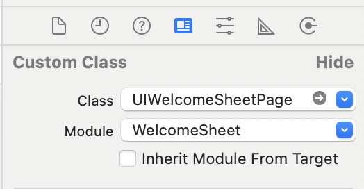
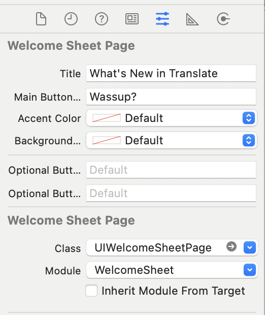
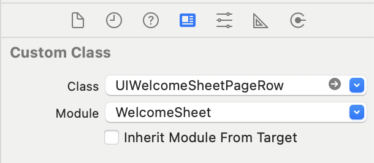
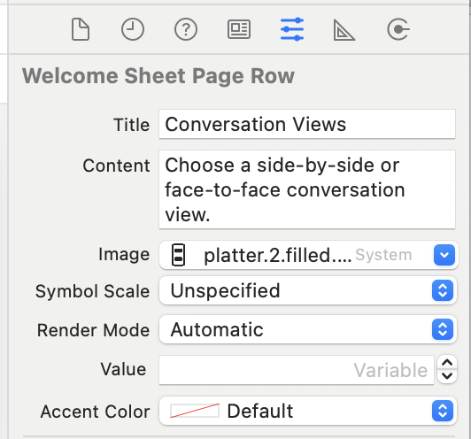
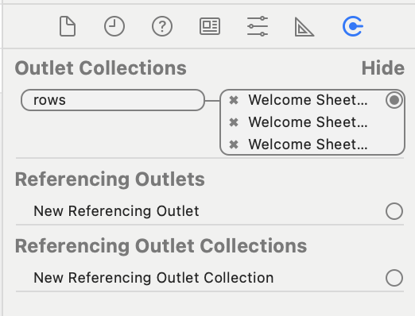
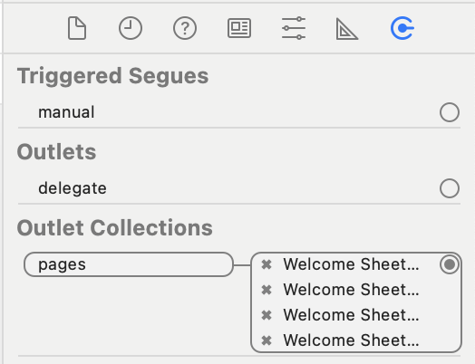
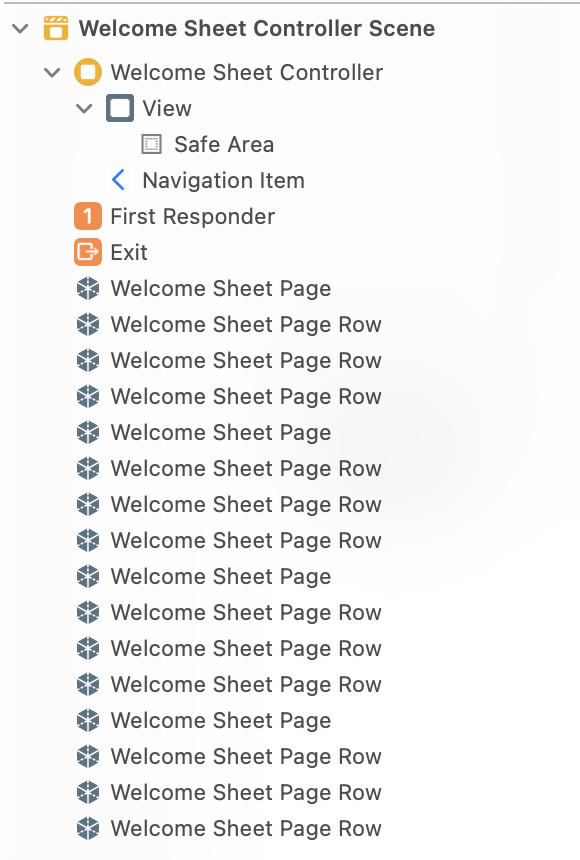

# Configuring from Storyboards

You can set up the pages of your Welcome Sheet from a Storyboard or XIB file—without writing a single line of code. Check out the [demo](../../Demo/UIKit-Storyboard-WelcomeSheetDemo/) for more details.

## Creating a WelcomeSheetStoryboardController

Drag out a new UIViewController and set the class to `WelcomeSheetStoryboardController`.

    
    

## Creating a page

- Create a new object and set the class to `UIWelcomeSheetPage`.  

    
    

- Go to the *Attributes* tab and configure the page.

### Adding a row to the page

- Create a new object and set the class to `UIWelcomeSheetPageRow`.  

    
    

- Go to the *Attributes* tab and configure the row.  

- Go to the *Connections* tab of your *page* and connect the `rows` outlet collection to all of the rows for the page.

### Connecting a page to the controller

- On your controller, go to the *Connections* tab and make a connection for each of your pages.  

## Summary

To configure your Welcome sheet from a storyboard do as follows:

- Drag out a new UIViewController and set the class to `WelcomeSheetStoryboardController`.  
- For each of your pages:
    - Drag out a new Object and set the class to `UIWelcomeSheetPage`.
    - Configure the attributes
    - For each of the rows in your page:
        - Drag out a new Object and set the class to `UIWelcomeSheetPageRow`.
        - Configure the attributes
        - Connect the row to your page by draging out a connection to the `rows` outlet.
    - Connect the page to your sheet by draging out a connection to the `pages` outlet.
- You now have a Welcome Sheet without writing a single line of code!

You should end up with a lot of objects like so:

# Using a System Symbol in a UIImage

Due to conversion issues between `UIImage` and SwiftUI’s `Image`, system symbols will have a squashed appearance. Welcome Sheet overcomes this issue by obtaining the name of the system symbol from the `UIImage` and creating a new `Image` from the system name.