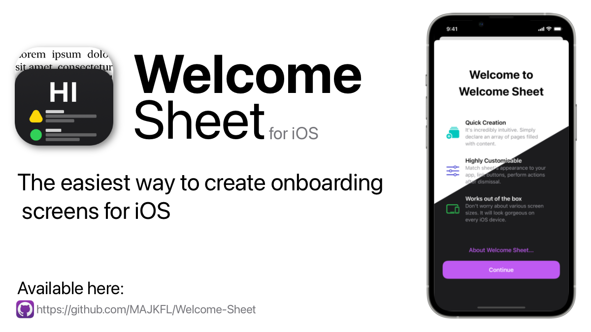

# Welcome Sheet



Welcome sheet for swiftUI enables incredibly easy way for creating onboarding screens, update notes, or whatever you imagine! The main idea standing behind this project was to follow the design of Apple’s native onboarding screens as much as possible, that’s why you can be always sure they will look gorgeous on iPhone SE screen as well as on iPad Pro’s massive 12,9” display!

<p align="center">
    
</p>

## Usage
To create a welcome sheet simply add .welcomeSheet view modifier to your view and pass page array as an argument.
```swift
import SwiftUI
import WelcomeSheet

struct ContentView: View {
    @State private var showSheet = false
    
    let pages = [
        WelcomeSheetPage(title: "Welcome to Welcome Sheet", rows: [
            WelcomeSheetPageRow(imageSystemName: "rectangle.stack.fill.badge.plus",
                                title: "Quick Creation",
                                content: "It's incredibly intuitive. Simply declare an array of pages filled with content."),
            
            WelcomeSheetPageRow(imageSystemName: "slider.horizontal.3",
                                title: "Highly Customisable",
                                content: "Match sheet's appearance to your app, link buttons, perform actions after dismissal."),
            
            WelcomeSheetPageRow(imageSystemName: "ipad.and.iphone",
                                title: "Works out of the box",
                                content: "Don't worry about various screen sizes. It will look gorgeous on every iOS device.")
        ])
    ]
    
    var body: some View {
        Button("Show sheet") {
            showSheet.toggle()
        }
        .welcomeSheet(isPresented: $showSheet, pages: pages)
    }
}
```

## .welcomeSheet

`.welcomeSheet` presents welcome sheet with given pages when a binding to a Boolean value that you provide is true.

```swift
.welcomeSheet(isPresented: $showSheet, 
              onDismiss: { /* Run this code when sheet is dismissed */ }, 
              isSlideToDismissDisabled: true, 
              pages: pages)
```

- `isPresented` - `bool` binding. When set to `true` presents sheet.
- `onDismiss` - Closure called after sheet's dismissal.
- `isSlideToDismissDisabled` - When set to `true` disables sheet's swipe to dismiss gesture.
- `pages` - Table of pages to be displayed chronologically.

## WelcomeSheetPage

`WelcomeSheetPage` type that describes page's content.

```swift
WelcomeSheetPage(title: "Welcome to Welcome Sheet", rows: [
    // Rows
],
accentColor: Color.purple, 
mainButtonTitle: "Let's go!",
optionalButtonTitle: "About Welcome Sheet...", 
optionalButtonURL: URL(string: "https://github.com/MAJKFL/Welcome-Sheet"))
```
- `title` - Large title displayed on the top.
- `rows` - Rows of content inside a body
- `mainButtonTitle` - Optional title for a main button. Set to `"Continue"` by default.
- `accentColor` - Color used for buttons. When set to `nil`, uses default accent colour.
- `optionalButtonTitle` - Title for an optional button.
- `optionalButtonURL` - `URL` to open when an optional button is pressed.

## WelcomeSheetPageRow

`WelcomeSheetPageRow` describes row's content.

```swift
WelcomeSheetPageRow(imageSystemName: "ipad.and.iphone", // Or `image: Image("ExampleImageName")`
                    accentColor: Color.green,
                    title: "Works out of the box",
                    content: "Don't worry about various screen sizes. It will look gorgeous on every iOS device.")
```
- `imageSystemName` - SF Symbol name for image displayed at the beginning of a row.
- `image` - Image displayed at the beginning of a row.
- `accentColor` - Color used for an image. When set to `nil`, uses default accent colour.
- `title` - Title displayed over a content.
- `content` - Text displayed beneath a title.

## Decodable support

You can decode pages from JSON.

```JSON
[
   {
      "optionalButtonURL":"https:\/\/github.com\/MAJKFL\/Welcome-Sheet",
      "accentColor":"BF5AF2",
      "isShowingOptionalButton":true,
      "title":"Welcome to Welcome Sheet",
      "rows":[
         {
            "accentColor":"63E6E1",
            "title":"Quick Creation",
            "content":"Sheet creation is incredibly intuitive. Simply create an array of pages filled with your content.",
            "imageName":"rectangle.stack.fill.badge.plus"
         },
         {
            "accentColor":"5E5CE6",
            "title":"Highly Customizable",
            "content":"Set accent colors, add optional buttons, disable dismiss gestures, perform actions after button taps or sheet dismissal and more!",
            "imageName":"gears"
         },
         {
            "accentColor":"30D158",
            "title":"Works out of the box",
            "content":"Don't worry about different screen sizes. Your Welcome Sheet will look gorgeous on every iOS device!",
            "imageName":"ipad.and.iphone"
         }
      ],
      "optionalButtonTitle":"About Welcome Sheet...",
      "mainButtonTitle":"Continue"
   }
]
```

**Note:** `imageName` can store asset catalogue image name or SF Symbol name.

## Installation

Using Swift Package Manager

```
.package(url: "https://github.com/MAJKFL/Welcome-Sheet", from: "0.1.0"),
```

## Example

``` Swift
import SwiftUI
import WelcomeSheet

struct ContentView: View {
    @State private var showSheet = false
    
    let pages = [
        WelcomeSheetPage(title: "Welcome to Welcome Sheet", rows: [
            WelcomeSheetPageRow(imageSystemName: "rectangle.stack.fill.badge.plus",
                                accentColor: Color.mint,
                                title: "Quick Creation",
                                content: "It's incredibly intuitive. Simply declare an array of pages filled with content."),
            
            WelcomeSheetPageRow(imageSystemName: "slider.horizontal.3",
                                accentColor: Color.indigo,
                                title: "Highly Customisable", content: "Match sheet's appearance to your app, link buttons, perform actions after dismissal."),
            
            WelcomeSheetPageRow(imageSystemName: "ipad.and.iphone",
                                accentColor: Color.green,
                                title: "Works out of the box",
                                content: "Don't worry about various screen sizes. It will look gorgeous on every iOS device.")
        ], accentColor: Color.purple, optionalButtonTitle: "About Welcome Sheet...", optionalButtonURL: URL(string: "https://github.com/MAJKFL/Welcome-Sheet")),
        
        WelcomeSheetPage(title: "What's New in Translate", rows: [
            WelcomeSheetPageRow(imageSystemName: "platter.2.filled.iphone",
                                title: "Conversation Views",
                                content: "Choose a side-by-side or face-to-face conversation view."),
            
            WelcomeSheetPageRow(imageSystemName: "mic.badge.plus",
                                title: "Auto Translate",
                                content: "Respond in conversations without tapping the microphone button."),
            
            WelcomeSheetPageRow(imageSystemName: "iphone",
                                title: "System-Wide Translation",
                                content: "Translate selected text anywhere on your iPhone.")
        ], mainButtonTitle: "Wassup?")
    ]
    
    var body: some View {
        Button("Show sheet") {
            showSheet.toggle()
        }
        .welcomeSheet(isPresented: $showSheet, onDismiss: { print("Sheet dismissed") }, isSlideToDismissDisabled: true, pages: pages)
    }
}
```
